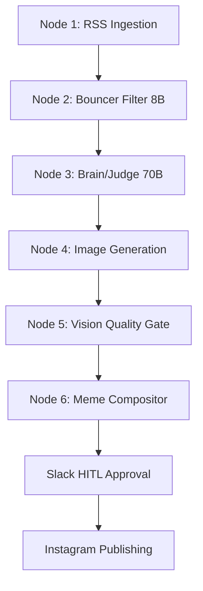

# 🚀 Autonomous AI Meme Agent

An enterprise-ready, autonomous AI agent that ingests tech news, analyzes relevance, generates witty developer memes, validates them via an AI Vision Gate, and posts them to social media (Instagram) with a Slack Human-in-the-Loop (HITL) approval step.

## Architecture



## Quick Start & Setup

### 1. Environment Variables
Copy `.env.example` to `.env`. You will need to fill in API keys for Groq, HuggingFace, Slack, and Meta by following the setup steps below.

### 2. Slack Setup (Human-in-the-Loop)
To allow the AI to send you memes for approval before posting:
1. Go to [api.slack.com/apps](https://api.slack.com/apps) and click **Create New App** (from scratch).
2. Go to **OAuth & Permissions** -> **Scopes** and add the following **Bot Token Scopes**:
   - `chat:write`
   - `files:write`
3. Click **Install to Workspace** and copy the **Bot User OAuth Token** (starts with `xoxb-`). Add this to your `.env` as `SLACK_BOT_TOKEN`.
4. In your Slack app, right-click the channel you want the bot to post in, select **View channel details**, and copy the Channel ID at the bottom. Add this to your `.env` as `SLACK_CHANNEL_ID`.
5. Go to **Basic Information** and copy the **Signing Secret**. Add this to your `.env` as `SLACK_SIGNING_SECRET`.

### 3. Expose Server to the Internet (Cloudflare Tunnel)
*(Note: We use Cloudflare instead of `localhost.run`, `ngrok`, or `pinggy` because those free tunnels force phishing warning screens that block Slack's robot from clicking the Approve button).*

To allow Slack and Instagram to communicate with your local server, start a free Cloudflare tunnel:
1. Download `cloudflared` for your OS.
2. Run the tunnel pointing to your Uvicorn port:
```powershell
.\cloudflared.exe tunnel --url http://localhost:8000
```
3. Copy the `https://something.trycloudflare.com` URL it generates and set it as `BASE_URL` in your `.env` file.

### 4. Configure Slack Interactivity
Once your Cloudflare tunnel is running and your `BASE_URL` is updated:
1. In the Slack Developer Dashboard, go to **Interactivity & Shortcuts**.
2. Toggle Interactivity **On**.
3. Set the **Request URL** to your Cloudflare URL: `https://[YOUR_CLOUDFLARE_URL]/slack/actions`
4. Click **Save Changes** at the bottom of the page.

### 5. Run the Server
Start the Uvicorn server so it can receive Slack webhooks:
```powershell
uv run uvicorn main:app --host 0.0.0.0 --port 8000 --reload
```

### 6. Instagram Setup & Tokens
1. Go to the [Meta Developer Portal](https://developers.facebook.com/) and create a Business app.
2. Link your Instagram Professional account to a Facebook Page to find your `INSTAGRAM_ACCOUNT_ID`.
3. Generate a User Access Token with `instagram_basic` and `instagram_content_publish` permissions. 
> [!WARNING]  
> Graph API tokens expire. If you see a "Session has expired" error in Slack when clicking Approve, you must generate a new token in the Developer Portal and update `META_ACCESS_TOKEN` in your `.env`.

## Running the Demo

To test the end-to-end flow without hitting Groq API rate limits (which bypasses LLM text generation), trigger the mock demo:
```powershell
curl.exe -X POST http://localhost:8000/api/v1/run-demo
```
This will instantly send a generated meme to your Slack channel. Click **Approve** to post it to Instagram!

## Running Tests

The project includes a comprehensive test suite using `pytest`.
To run all test cases, simply execute:
```powershell
uv run pytest
```
To run tests with coverage reporting:
```powershell
uv run pytest --cov=nodes
```
